# Setup And Writing Your First Automation

In this little tutorial I will show you how to set up and write a simple automation.
We will be automating an Android app, because you can replicate the tutorial on Windows, Mac and Linux (for free).

If you find that [The Setup](#the-setup) is not comprehensible for you, then you can also
use [Quickstart from Appium docs](https://appium.io/docs/en/2.1/quickstart/)
to set up Android Studio and Appium.

After you set up Android Studio, Appium and UiAutomator2, you can write [your first automation](#the-first-automation).

## What Will You Need?

* Your favorite IDE and Rust,
* Android Studio (with an emulator),
* basic knowledge of system terminal (like bash, zsh or PowerShell),
* `npm` (or some package manager that will allow you to install npm),
* Java JDK 9+ (for UiAutomator2 driver).

## In this tutorial

* [The Setup](#the-setup)
    * [Android Studio Setup](#android-studio-setup)
        * [Installing Android SDK](#installing-android-sdk-platform-tools-with-adb)
        * [Set Up The Emulator](#set-up-the-emulator)
    * [Appium Setup](#appium-setup)
        * [Installing npm](#installing-npm)
        * [Installing Java JDK 9+](#installing-java-jdk-9)
        * [Installing Appium via npm](#installing-appium-via-npm)
        * [Installing UiAutomator2 Driver](#installing-uiautomator2-driver)
        * [Installing Appium Inspector](#installing-appium-inspector)
* [The First Automation](#the-first-automation)
  * [Preparing The Environment](#preparing-the-environment)
    * [Download Demo APK](#download-demo-apk)
    * [Start The Emulator](#start-the-emulator)
    * [Start Appium](#start-appium)
    * [Test Configuration via Appium Inspector](#test-configuration-via-appium-inspector)
  * [The Development](#the-development)
    * [Set Up a Rust Project](#set-up-a-rust-project)
    * [Run App via Rust Code](#run-app-via-rust-code)
    * [Automating A Tap On Element](#automating-a-tap-on-element)
    * [Different Types Of Locators](#different-types-of-locators)
    * [Entering Text](#entering-text)
    * [Going Back And Scrolling](#going-back-and-scrolling)

# The Setup

## Android Studio Setup

Android Studio is needed for two things:

* **ADB** (from Android SDK) - Appium needs this to communicate with the Android device,
* **the emulator** (optional) - the app has to be run somewhere.

You can skip the emulator part if you wish to use your own device.
But nonetheless you will need ADB, and we will use Android Studio to install it for us.

Download and install Android Studio from its official website: https://developer.android.com/studio.

### Installing Android SDK (Platform Tools with ADB)

When launch Android Studio, you should be greeted with a message saying that SDK is missing.

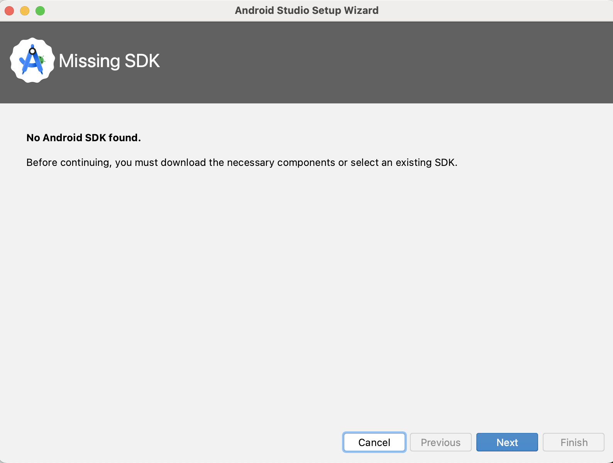

Just follow the steps in this wizard (click "Next") and remember to accept the license.
Android Studio will automatically download the SDK for you.

Now validate the configuration by clicking `More Actions` and `SDK Manager`.

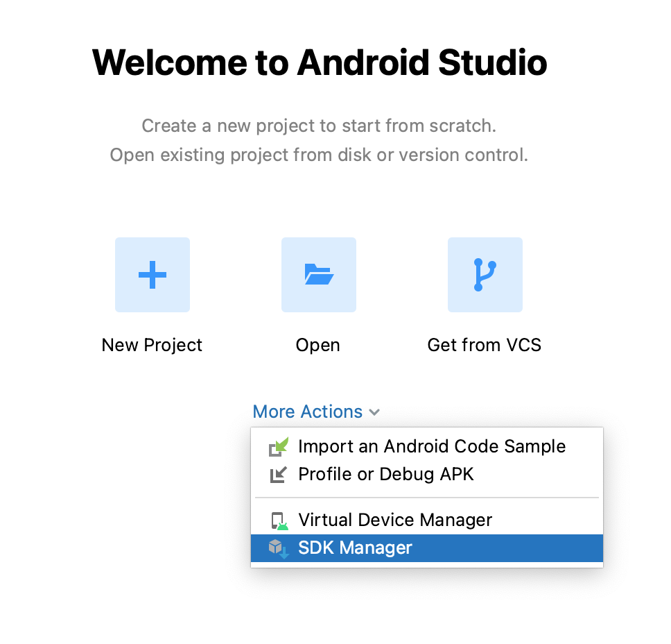

In this window validate the following:

* Android SDK Location (should not be empty),
* SDK Platforms (at least one should be selected, e.g. `Android 14.0 ("UpsideDownCake")` (API 34)),
* SDK Tools: Android SDK Build-Tools, Android Emulator, Android SDK Platform-Tools (those should be selected).

If you're missing any of the components, select the missing components.

If the window is greyed out, and you cannot select anything (or you have no SDK Location), then you have to fix the SDK.
Part of the window should look like on the screenshot below.
Click "Edit" and an SDK wizard should appear and will install missing components of your SDK.

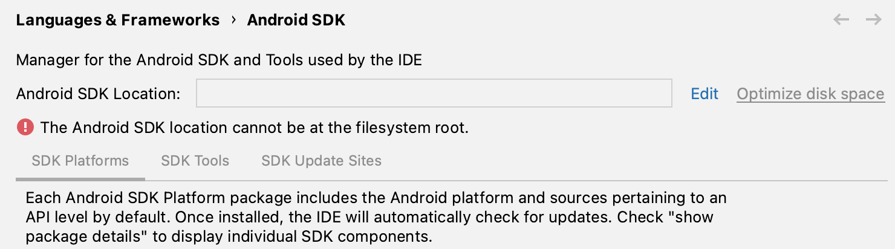

Now set up the `ANDROID_HOME` environment variable, so it points to the SDK directory.
The SDK directory is the "Android SDK Location" from the screen shown above.

For example, if the SDK is installed in `/Users/multicatch/Library/Android/sdk`, then your variable should
be `ANDROID_HOME=/Users/multicatch/Library/Android/sdk`.

On Windows you can edit environment variables by searching "environment properties" in the Start Menu.
Click the first result and then click "Environment Variables..." to edit variables.

On Mac add the following line to `.zshrc` and on Linux you have to add the following line to `.bashrc`:

```bash
export ANDROID_HOME=/your/path/here
```

Both files should be in your home directory (they are hidden).

### Set Up The Emulator

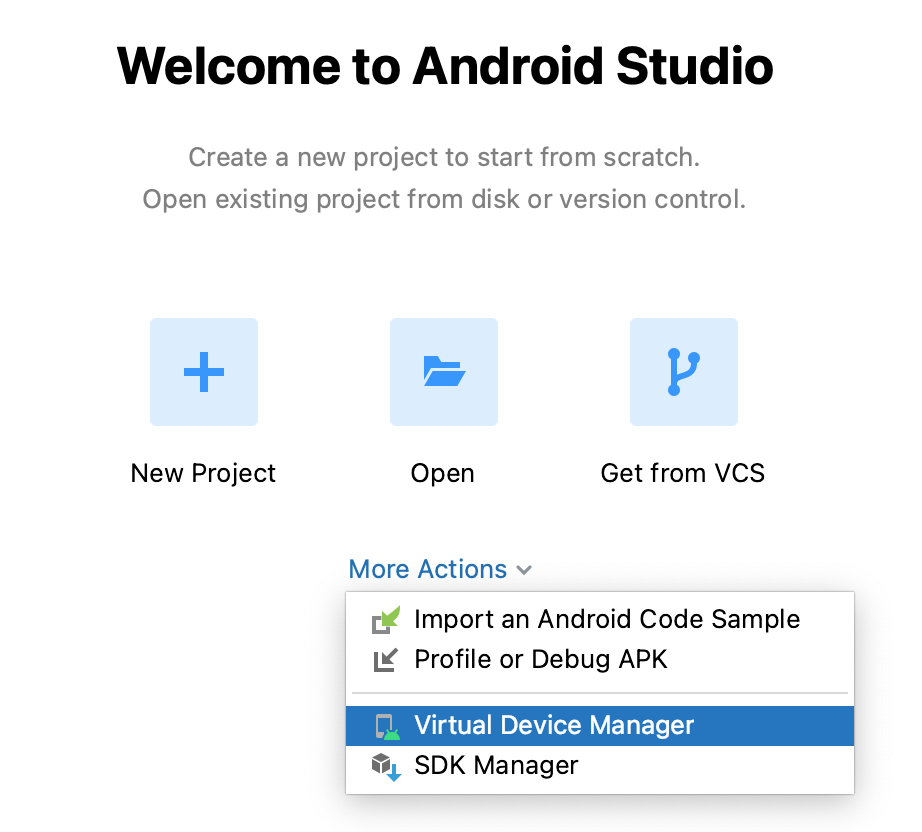

From the Android Studio welcome screen, select `More Actions` and `Virtual Device Manager`.
In the next window, click the plus sign (or "Create virtual device...").

Select any virtual device model you want. I selected `Pixel 7` and clicked "Next".

After device model selection, you will have the option to choose Android version you want to install on the emulator.
This version is also tied to the SDK version, as you can see in the "API Level" column.

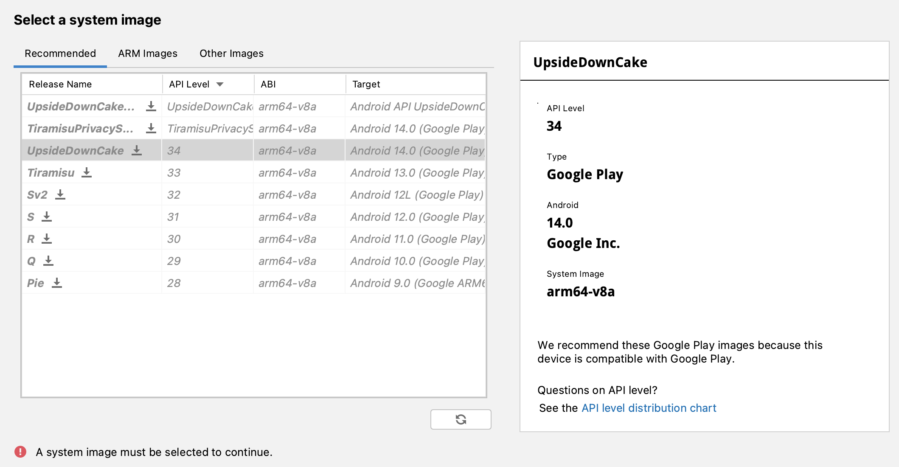

I have chosen "UpsideDownCake" (Android 14.0, API 34). If your "Next" button is greyed out, you need to download the SDK
first.
Click the download icon next to selected system image and "Next" should become clickable after a while.

In the next step, you can adjust some emulator settings and name the virtual device (AVD).
I left the defaults and clicked "Finish".

Start the AVD.

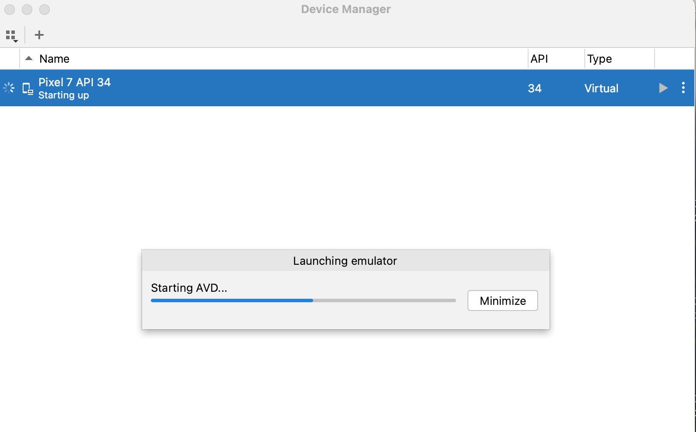

You should be all set now.

## Appium Setup

We will need Appium and UiAutomator2 driver.

To install Appium, you will need `npm`.

### Installing npm

#### Windows

Download and install https://nodejs.org/en/download. Run `npm -v` to verify installation.

#### Mac

Download and install https://nodejs.org/en/download. If you have `homebrew`, you can just run:

```bash
brew install node
```

Run `npm -v` to verify installation (you will probably need to restart the Terminal first to reload the shell).

#### Linux

Use your favorite package manager to install `npm`.
For example:

```bash
sudo apt update
sudo apt install nodejs npm
```

### Installing Java JDK 9+

Use your favorite JDK. You can use one from https://jdk.java.net/, or https://adoptium.net/temurin/releases/.

Installation instructions might be different depending on which JDK release you choose.

Note: **The minimum JDK version must be 9** (but you can choose a newer one).

Java is needed to run UiAutomator2, this driver is written in Java and Appium will need to run it in order to control
the Android device.

Remember to set up `JAVA_HOME`. If you used an installer, then it might be configured automatically.
If not, then set it [like we set up `ANDROID_HOME`](#installing-android-sdk-platform-tools-with-adb), but it should
point to a location where Java is installed.

Verify that your `JAVA_HOME` points to the JDK home directory.
The following command should show you folders like `bin` and `include`.

```bash
ls "$JAVA_HOME"
```

If you got an error (or there is no `bin` and `include`), then the environment variable is configured incorrectly.

### Installing Appium via npm

To install Appium globally run the following command:

```bash
npm i -g appium
```

Verify your installation by running `appium`. Use ctrl+c to exit appium when you're done.

### Installing UiAutomator2 Driver

The UiAutomator2 driver is a tool that helps Appium "talk" with the Android device.
Depending on whether you test on iOS, or Android, or other platform, you need to install different drivers.

Apart from UiAutomator2, there is also another driver for Android called "Espresso".
But for our needs, we won't need it.

Run the following command to install UiAutomator2:

```bash
appium driver install uiautomator2
```

### Installing Appium Inspector

Appium Inspector is a tool that will help us understand what Appium knows about the currently displayed screen.

It's a really easy-to-use tool and I find it very useful during test automation development.

Download and install the tool from this page: https://github.com/appium/appium-inspector/releases.

You should be now ready to go!

# The First Automation

## Preparing The Environment

We need to do a few things to see whether we set up everything correctly (and before we start the development)

### Download Demo APK

Just download the newest demo apk from https://github.com/appium/android-apidemos/releases/.
Save it on your computer in a known location. We will need the path later.

For example, I have downloaded the APK to the following location:

```text
/Users/multicatch/apps/ApiDemos-debug.apk
```

### Start The Emulator

If the emulator is not running, then start Android Studio, click `More Actions` and `Virtual Device Manager`.
Select the emulator to run.

### Start Appium

Run `appium` in terminal.

### Test Configuration via Appium Inspector

Start Appium Inspector. It should look more or less like this:

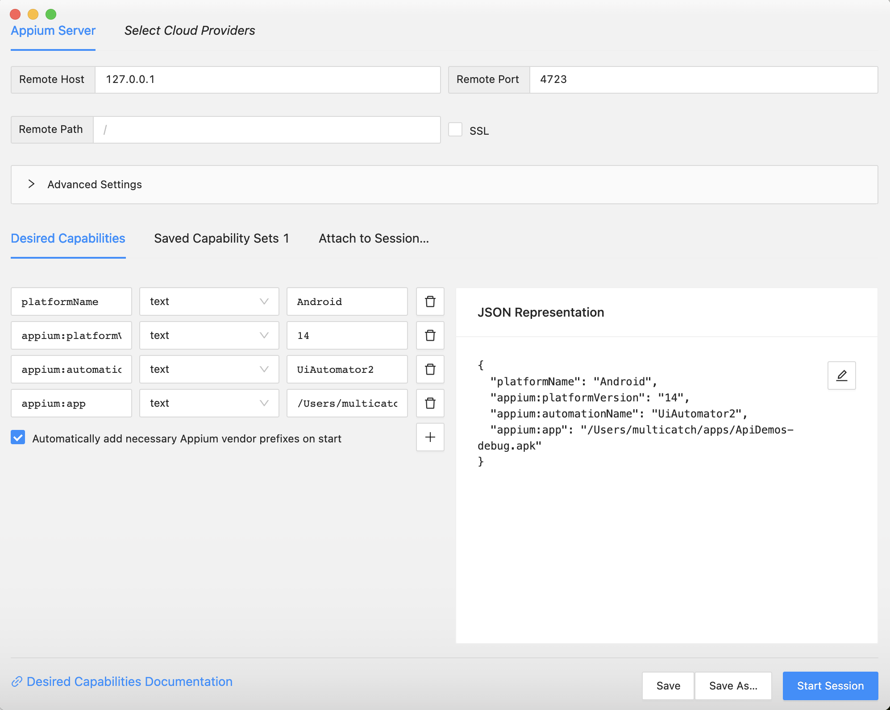

Verify the following configuration:

* Remote Host: `127.0.0.1`
* Port: `4723`
* Remote Path: `/` (or empty)

Now we can set **Desired Capabilities** to start the APK via Appium.

Desired capabilities (or capabilities in short) are a set of configuration properties for Appium
that tell the Appium and the driver how to behave.

Capabilities can tell appium:

* which device to use,
* which app to use,
* how to start the app (if it doesn't start normally),
* how long to wait for the app to start,
* if you want to reset the app before each test,
* if you want to reinstall the app before each test,
* and many more.

Depending on which driver you use, you might need different capabilities.
You can read more about capabilities by clicking the link at the bottom of Inspector's window.

In our case, the configuration will be very simple.

Configure the following capabilities:

| Capability        | Type   | Value                                                                     |
|-------------------|--------|---------------------------------------------------------------------------|
| `platformName`    | `text` | `Android`                                                                 |
| `platformVersion` | `text` | `14` (use different value if you have installed other Android version)    |
| `automationName`  | `text` | `UiAutomator2`                                                            |
| `app`             | `text` | path to your apk, in my case: `/Users/multicatch/apps/ApiDemos-debug.apk` |

Make sure that "Automatically add necessary Appium vendor prefixes on start".

Click "Start Session". The app should start.

Appium Inspector will now show the captured app screen and the "App Source".

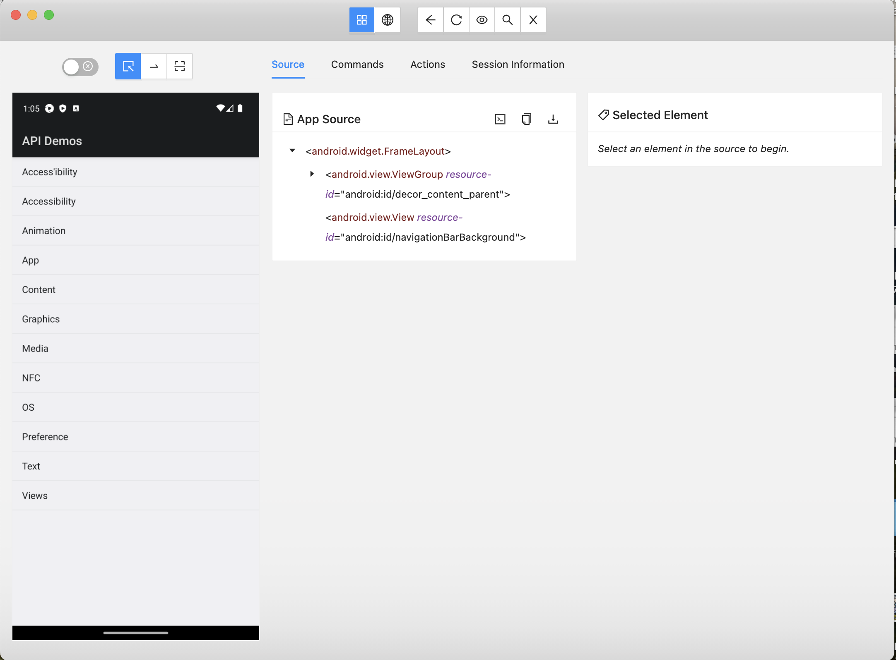

Appium Inspector does not update the screen live. 
It only shows a capture. 
To refresh the view, you need to click "refresh" icon in the top bar.

When you click any element on the screenshot, then Inspector will highlight
a part of the App Source, which represents the element.

In the right panel you will see properties of selected element.
You can simulate "tap" by clicking the crosshair button.

Try to play around in Appium Inspector on your own.

## The Development

### Set Up a Rust Project

Use `cargo init` or your IDE to create a new Rust project.
I use an outdated IntelliJ IDEA CE with Rust plugin.

Add the following dependencies to `Cargo.toml`:

```toml
appium-client = "0.2.1"
fantoccini = "0.19.3"
tokio = "1.25.0"
```

And create empty app in `main.rs` with tokio runtime.

```rust
#[tokio::main]
async fn main() -> Result<(), Box<dyn std::error::Error>> {
    Ok(())
}
```

Verify if everything was set up correctly with `cargo build`.

### Run App via Rust Code

Now to start an Appium session from Rust, we need to:
* create a set of capabilities (like in Appium Inspector),
* connect to Appium server and start the session (which here is the same as creating the client).

We are automating an Android test with UiAutomator2 driver. 
So we can use `AndroidCapabilities::new_uiautomator()` to create basic set of capabilities for that purpose.

When you create `AndroidCapabilities` by using `new_uiautomator()`, then you will automatically set:
* `platformName` = `Android`
* `automationName` = `UiAutomator2`

Now we need to set only the two last capabilities - `platformVersion` and `app`.

```rust
use appium_client::capabilities::android::AndroidCapabilities;
use appium_client::capabilities::{AppCapable, AppiumCapability};

#[tokio::main]
async fn main() -> Result<(), Box<dyn std::error::Error>> {
    let mut capabilities = AndroidCapabilities::new_uiautomator();
    capabilities.platform_version("14");
    capabilities.app("/Users/multicatch/apps/ApiDemos-debug.apk");

    Ok(())
}
```

To start a session with those capabilities, create a client using `ClientBuilder`.

We will use `ClientBuilder::native(capabilities)`, because we want to use a native HTTP client to connect to Appium server.
We also need to specify the address of Appium server, which is `http://localhost:4723/`.

```rust
use appium_client::capabilities::android::AndroidCapabilities;
use appium_client::capabilities::{AppCapable, AppiumCapability};

#[tokio::main]
async fn main() -> Result<(), Box<dyn std::error::Error>> {
    let mut capabilities = AndroidCapabilities::new_uiautomator();
    capabilities.platform_version("14");
    capabilities.app("/Users/multicatch/apps/ApiDemos-debug.apk");

    let _client = ClientBuilder::native(capabilities)
        .connect("http://localhost:4723/")
        .await?;

    Ok(())
}
```

Voilà! Try running the program. 

It should connect to the Appium server and start the app.

If it did not work, then check if:
* You did not copy the path to app (and the path is correct),
* Appium server is running,
* Appium and UiAutomator2 was set up correctly,
* Android emulator is running,
* The device is unlocked,
* You enabled debugging on your Android device.

### Automating A Tap On Element

So let's try to automate a tap on an element.
Appium need to know where to tap.
We need a way to locate an element, so we can tell Appium "find this element and tap it".

Let's go back to Appium Inspector. 
**Before we start using it again, we need to restart the session.**

When you run a test in your code, it automatically replaces Appium Inspector session. 
Appium Inspector looses the ability to do anything in Appium.

So after you run your automation, you need to restart the session in the Inspector.
Close session by clicking "x" in the top bar and then "Start Session" again.

Click "Views" in the screen capture.

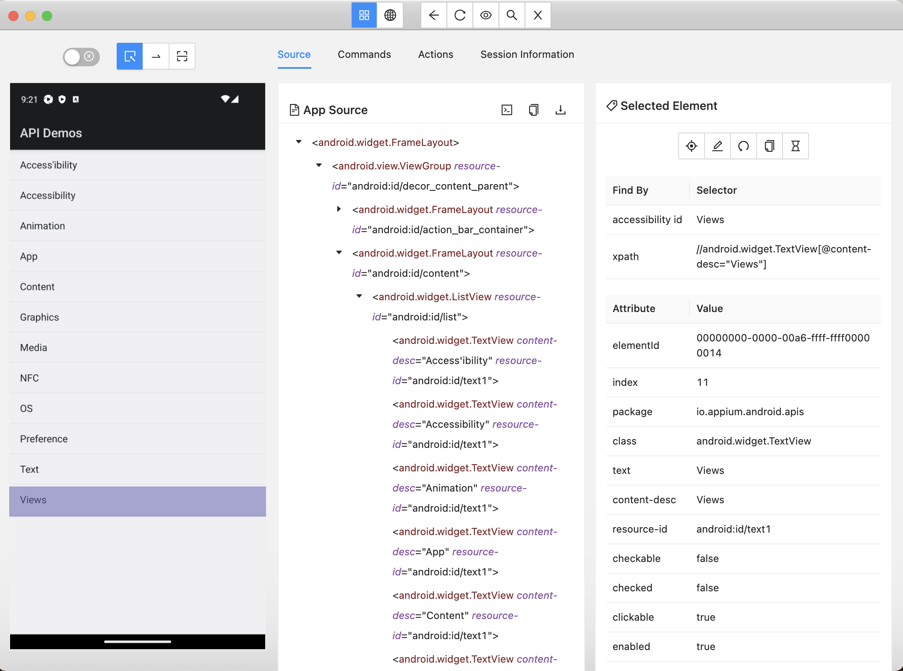

We can see many attributes that seem like a good way to tell Appium how to find an element we want to tap.
For example, `accessibility id` looks promising - it's just `Views`. And we want to tap `Views`.

Let's go back to code.

To find an element on screen, we will use `find_by`. 
Your IDE might suggest you a very similarly named function `find`.
**But don't use that one**. 

Function `find` is a base Selenium function, and it does not support special Appium features.
`find_by` is an enhanced function, which gives you more options and more flexibility with Appium.

This function needs a parameter of type `By`. `By` represents two thing:
* how to look for an element (by `accessibility id`),
* what to expect (`Views`).

Usage of `find_by` and `By` in this case looks like this:

```text
let views = client.find_by(By::accessibility_id("Views"))
    .await?;
```

As you can see this function is `async` and we need to `await`.

But now we have the element, and we will try to click it.
Thankfully, `views` is a special struct of type `Element` that has functions to interact with the element.

One of those functions is `click()`.

```text
views.click().await?;
```

Again, this function is `async` too.

The complete working code looks like this:

```rust
use appium_client::capabilities::android::AndroidCapabilities;
use appium_client::capabilities::{AppCapable, AppiumCapability};
use appium_client::ClientBuilder;
use appium_client::find::{AppiumFind, By};

#[tokio::main]
async fn main() -> Result<(), Box<dyn std::error::Error>> {
    let mut capabilities = AndroidCapabilities::new_uiautomator();
    capabilities.platform_version("14");
    capabilities.app("/Users/multicatch/apps/ApiDemos-debug.apk");

    let client = ClientBuilder::native(capabilities)
        .connect("http://localhost:4723/")
        .await?;

    let views = client.find_by(By::accessibility_id("Views"))
        .await?;

    views.click().await?;

    Ok(())
}
```

### Different Types Of Locators

If you read [documentation of By](https://multicatch.github.io/appium-client/appium_client/find/enum.By.html#impl-By),
you could see that there are different types of locators.

Those are:
* `accessibility_id` - it matches the value of `accessibility id` (the same you see in Appium Inspector),
* `class_name` - it's the same as `class` in Appium Inspector,
* `id` - in case of Android, it's the same as `resource-id`; in iOS it's `name`,
* `uiautomator` - UiAutomator2 allows you to write a piece of Java code with an expression that can be used to locate the element (it can even scroll the screen).
* `xpath` - it's a special expression for finding nodes in XML. In our case, the XML is the "App Source" you see in Appium Inspector. Appium Inspector also displays XPath expression when you select an element on screen.

In iOS tests you can use almost all of the above (except for `uiautomator`). But there are also some locators that are iOS-only:
* `name` - matches attribute `name`,
* `ios_class_chain` - it's a special expression (like XPath), but is specific to XCUITest. It's a faster, but less powerful alternative to XPath.
* `ios_ns_predicate` - it's another special expression, but searches in a different way ([ios_ns_predicate documentation](https://github.com/appium/appium-xcuitest-driver/blob/master/docs/ios-predicate.md)).

If you're confused how they work, you can always test them out in Appium Inspector.

There's a magnifying glass icon in the top toolbar. 
It opens a window where you can select a Locator Strategy and the selector.

For example, if I choose `Accessibility ID` and enter `Views`, then I will get only one result.
The result is, of course, the element that we click in our Rust code.

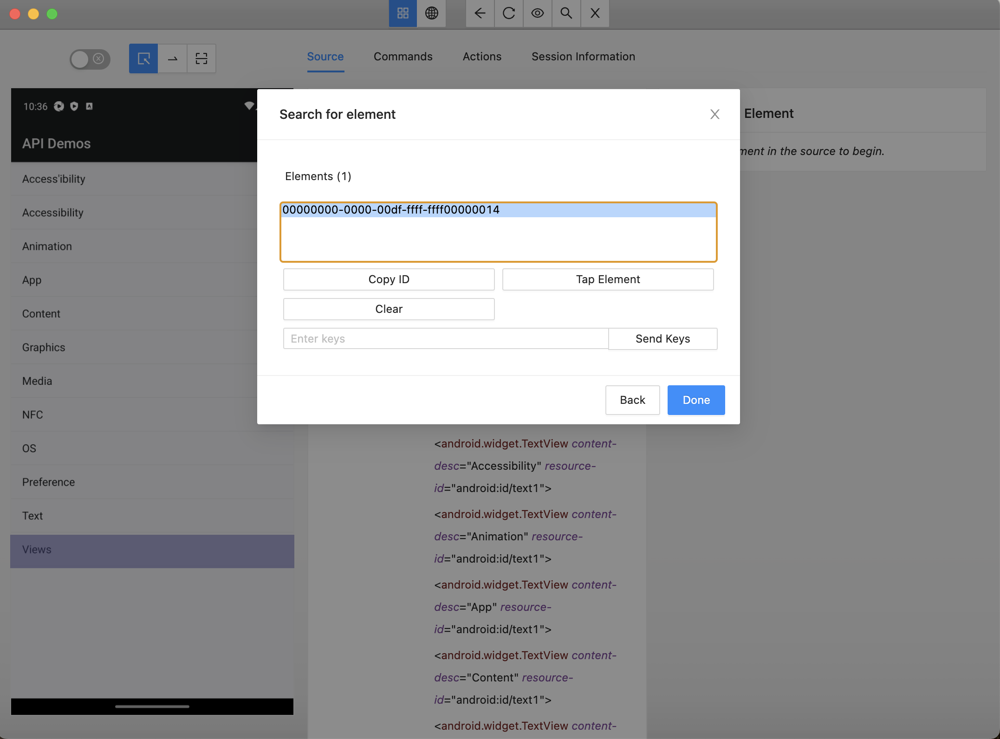

You can see in the above screenshot that I have one result, and when I selected it, "Views" is highlighted.
Success!

Let's try something else. This time, I'll choose `Class Name` and enter `android.widget.TextView`.

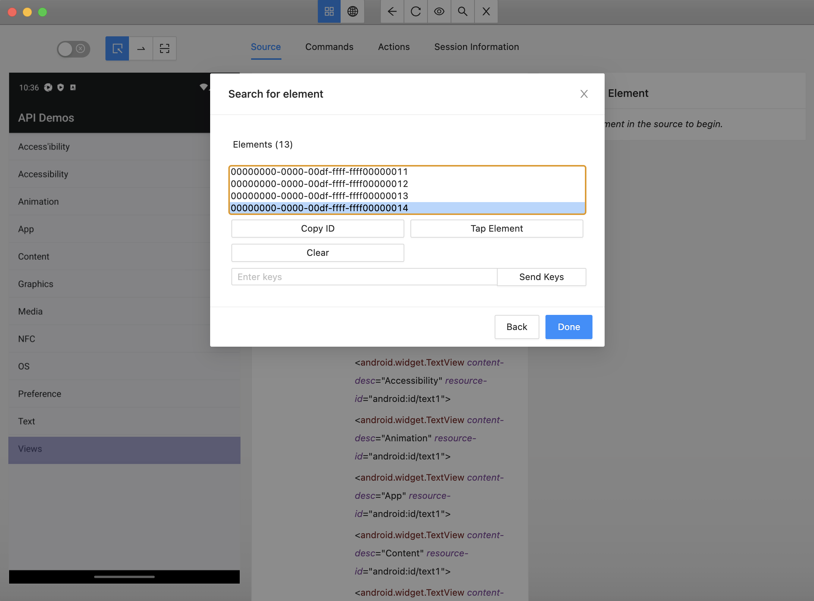

Now I have a lot of results. The last one (which I have selected) is "Views".

This kind of locator usually returns a lot of results (you know, screens are a complicated thing and reuse a lot of components).
But unfortunately it is rarely useful to use `find_by(By::class_name("xyz"))`.
`find_by` returns only one result, and what I'm looking for is probably further on the list of results.
How can we make it useful?

Thankfully, instead of using `find_by`, we can just use `find_all_by`, which returns a Vec of Elements.


```rust
use appium_client::capabilities::android::AndroidCapabilities;
use appium_client::capabilities::{AppCapable, AppiumCapability};
use appium_client::ClientBuilder;
use appium_client::find::{AppiumFind, By};

#[tokio::main]
async fn main() -> Result<(), Box<dyn std::error::Error>> {
    let mut capabilities = AndroidCapabilities::new_uiautomator();
    capabilities.platform_version("14");
    capabilities.app("/Users/multicatch/apps/ApiDemos-debug.apk");

    let client = ClientBuilder::native(capabilities)
        .connect("http://localhost:4723/")
        .await?;

    let text_views = client.find_all_by(By::class_name("android.widget.TextView"))
        .await?;

    for element in text_views {
        println!("TextView: {}", element.text().await?);
    }

    Ok(())
}
```

This code prints text of all `android.widget.TextView` elements on the screen.

```text
TextView: API Demos
TextView: Access'ibility
TextView: Accessibility
TextView: Animation
TextView: App
TextView: Content
TextView: Graphics
TextView: Media
TextView: NFC
TextView: OS
TextView: Preference
TextView: Text
TextView: Views
```

### Entering Text

Let's try simulating keyboard input. 
We need some kind of form in the app. 

Fortunately, there is one in `Views` > `Auto Complete` > `1. Screen Top`.

Restart the session in Appium Inspector and go through those steps to open the form.

If you clicked those menu items manually in the emulator (or on your device), 
then refresh source & screenshot using the icon in the top bar in the Inspector.

Or you could select `Views` in Inspector, click the crosshair to tap the element, and then repeat those steps for `Auto Complete` and `1. Screen Top`.

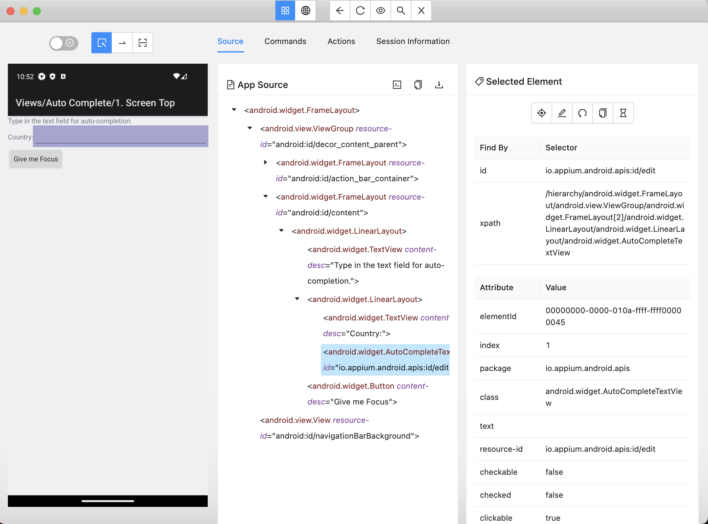

Let's inspect the text input next to the label "Country:". 
This time, Appium Inspector suggested using `id` or `xpath`.
This `xpath` looks unnecessarily complicated, so we will stick to `id`.

So based on what we have discovered in the Appium Inspector, 
we can already see that in our code we will have the following steps:

* `find_by(By::accessibility_id("Views"))` and click it
* `find_by(By::accessibility_id("Auto Complete"))` and click it
* `find_by(By::accessibility_id("1. Screen Top"))` and click it
* `find_by(By::id("io.appium.android.apis:id/edit"))`, click it (focus), enter text

We already know how to click elements. 
To enter text into a field, we will use `send_keys`.

`send_keys` is a function that you can use with an `Element`. 
Basically we just need to do `find_by(By).await?.send_keys("blahblah").await?`.

Let's try testing this autocomplete form by entering "fra" (like in "France").

```rust
use appium_client::capabilities::android::AndroidCapabilities;
use appium_client::capabilities::{AppCapable, AppiumCapability};
use appium_client::ClientBuilder;
use appium_client::find::{AppiumFind, By};

#[tokio::main]
async fn main() -> Result<(), Box<dyn std::error::Error>> {
    let mut capabilities = AndroidCapabilities::new_uiautomator();
    capabilities.platform_version("14");
    capabilities.app("/Users/multicatch/apps/ApiDemos-debug.apk");

    let client = ClientBuilder::native(capabilities)
        .connect("http://localhost:4723/")
        .await?;

    let views = client.find_by(By::accessibility_id("Views"))
        .await?;

    views.click().await?;
    
    client.find_by(By::accessibility_id("Auto Complete"))
        .await?
        .click()
        .await?;

    client.find_by(By::accessibility_id("1. Screen Top"))
        .await?
        .click()
        .await?;

    let country_input = client.find_by(By::id("io.appium.android.apis:id/edit"))
        .await?;
    
    country_input.click()
        .await?;

    country_input.send_keys("fra")
        .await?;

    Ok(())
}
```

Remember: Don't forget `await`s or your code will be faster than Appium (that's actually a bad thing and you will get errors).

### Going Back And Scrolling

So let's do something more complicated - let's scroll the screen.

It's not as easy as calling `scoll()` or something, because there is no such method.

And why would there be? Scrolling is not as obvious as it looks.
You can scroll part of an element, or an element inside scrollable element.
You can scroll vertically, horizontally, diagonally.
You can scroll by moving your finger 0.5cm on the screen, or by going berserk (you have a very long list and need to get to the bottom).

So to scroll, one must know how a finger moves across the screen.
That's the whole magic of scrolling. 

We will be simulating a scroll by simulating the following actions:
* moving your finger above the screen in the initial position,
* touching the screen,
* moving the finger (still touching the screen).

But first, let's do something easier. 
Let's hide the keyboard and go back twice, to a screen with a long list.

Thankfully, it's easier to do than scrolling.

```text
    client.hide_keyboard().await?;

    client.back().await?;

    client.back().await?;
```

Ok, now we're ready to do the magic.

First, start by defining something called `TouchActions::new("finger".to_string())`.
It will represent a sequence of actions we want to simulate with our virtual finger.

To add an action to this sequence, we use `then`. We will create a sequence of three actions:
* `PointerAction::MoveTo` to move the finger to an initial position,
* `PointerAction::Down` to touch the screen in this initial position,
* `PointerAction::MoveTo` to swipe the finger (that is still touching the screen).

```text
    let swipe_down = TouchActions::new("finger".to_string())
        // position the finger first
        .then(PointerAction::MoveTo {
            duration: Some(Duration::from_millis(0)),
            x: 400,
            y: 800,
        })
        // THEN touch the screen
        .then(PointerAction::Down {
            button: MOUSE_BUTTON_LEFT // believe me, it is not a mouse, but a simple touch
        })
        // THEN move the finger through the screen
        .then(PointerAction::MoveTo {
            duration: Some(Duration::from_millis(500)),
            x: 400,
            y: 100,
        });
```

Notice that you can specify duration to each finger movement. 
So you can move the finger faster or slower.
And you need to touch the screen with `MOUSE_BUTTON_LEFT` (which is the same as using `0`).

You can adjust `x` and `y` of the sequence depending on the screen of your virtual device.

To perform those actions, you need to submit them to Appium.
```text
    client.perform_actions(swipe_down)
        .await?;
```

The whole code looks like the following:

```rust
use std::time::Duration;
use appium_client::capabilities::android::AndroidCapabilities;
use appium_client::capabilities::{AppCapable, AppiumCapability};
use appium_client::ClientBuilder;
use appium_client::commands::keyboard::HidesKeyboard;
use appium_client::find::{AppiumFind, By};
use fantoccini::actions::{InputSource, MOUSE_BUTTON_LEFT, PointerAction, TouchActions};

#[tokio::main]
async fn main() -> Result<(), Box<dyn std::error::Error>> {
    let mut capabilities = AndroidCapabilities::new_uiautomator();
    capabilities.platform_version("14");
    capabilities.app("/Users/multicatch/apps/ApiDemos-debug.apk");

    let client = ClientBuilder::native(capabilities)
        .connect("http://localhost:4723/")
        .await?;

    let views = client.find_by(By::accessibility_id("Views"))
        .await?;

    views.click().await?;

    client.find_by(By::accessibility_id("Auto Complete"))
        .await?
        .click()
        .await?;

    client.find_by(By::accessibility_id("1. Screen Top"))
        .await?
        .click()
        .await?;

    let country_input = client.find_by(By::id("io.appium.android.apis:id/edit"))
        .await?;

    country_input.click()
        .await?;

    country_input.send_keys("fra")
        .await?;

    client.hide_keyboard().await?;

    client.back().await?;

    client.back().await?;

    let swipe_down = TouchActions::new("finger".to_string())
        // position the finger first
        .then(PointerAction::MoveTo {
            duration: Some(Duration::from_millis(0)),
            x: 400,
            y: 800,
        })
        // THEN touch the screen
        .then(PointerAction::Down {
            button: MOUSE_BUTTON_LEFT // believe me, it is not a mouse, but a simple touch
        })
        // THEN move the finger through the screen
        .then(PointerAction::MoveTo {
            duration: Some(Duration::from_millis(500)),
            x: 400,
            y: 100,
        });

    client.perform_actions(swipe_down)
        .await?;

    Ok(())
}
```